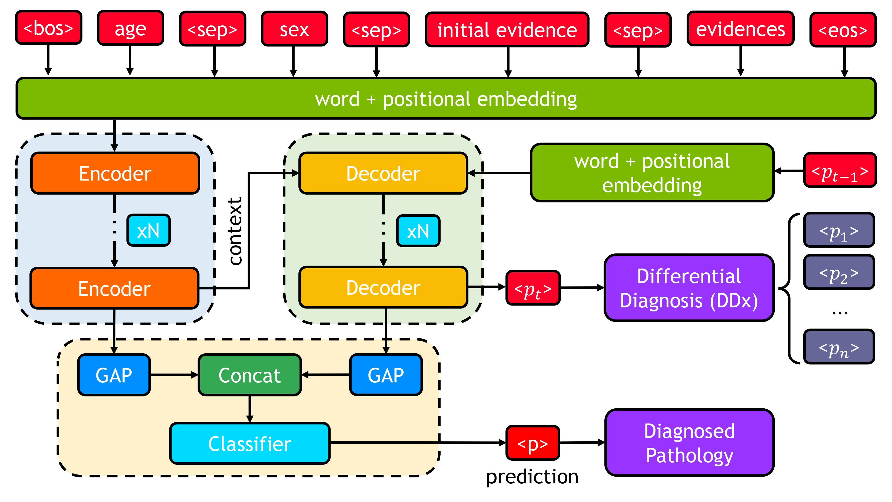

<h2 align="center">DDxT: Deep Generative Transformer Models for
Differential Diagnosis</h2>

DDxT is an automatic method for autoregressive generation of differential diagnosis (DDx) and prediction of the most likely pathology based on the patient's conditions and medical history built with Transformer. 

## Requirements


<p align="justify">
The code is written in <a href=https://pytorch.org>PyTorch</a>. Additionally, for tokenizing and input processing, it has a dependency on the HuggingFace transformers library. All the required libraries are listed in the requirements file. Create a conda environment and install the required libraries using the following commands. 

```properties
conda create -y -n ddxt
conda activate ddxt
cd $REPOSITORY_DIRECTORY
pip install -r requirements.txt
```

### Network Architecture 

<p align="center">

</p>

The network is trained and tested on an 8GB RTX 2070 Super Max-Q GPU with 16GB of main memory. 

### Requirements
- PyTorch [cuda] tested on version ```'1.10.2'```
- The working directory should have a ```data/``` folder having all the csv datasets and json files with dataset information. 
- The ```weights/``` folder should contain a ```model.h5``` file to successfully run the test.py file. 

### Project Structure

The working directory should have the following structure:
```
.
├── data/                   # contains dataset files 
├── evaluate/               # evaluation files 
├── results/                # temp cache files with eval output
├── weights/                # contains model.h5 file 
├── .gitignore
├── *.py 
└── README.md 
```

### Paper

[](https://arxiv.org/abs/2312.01242)

The code was developed for the differential diagnosis using transformers paper. For a more detailed explanation of the proposed
method, please go through the pdf of the [```paper```](https://arxiv.org/abs/2312.01242). If you use this work, code, or find this useful, please cite this
paper as:

[***```DDxT: Deep Generative Transformer Models for Differential Diagnosis```***](https://arxiv.org/abs/2312.01242)

```bibtex
@article{alam2023ddxt,
  title={DDxT: Deep Generative Transformer Models for Differential Diagnosis},
  author={Alam, Mohammad Mahmudul and Raff, Edward and Oates, Tim and Matuszek, Cynthia},
  journal={arXiv preprint arXiv:2312.01242},
  year={2023}
}
```

### Code Segments
```dataset.py```: generates data loader for training 

```network.py```: generates proposed network architecture 

```train.py```: train the network 

```test.py```: runs the network over the test dataset 

Here is the output of the ```test.py```: 

```text
Loading data & network ...
Start testing ...
test ddx acc: 73.71%, test cls acc: 99.50%, eta: 2.7e+02s
```

```inference.py```: runs the inference over a single sample of the dataset

The rest of the files are utility and helper files used to do the preprocessing task.

```preprocess.py```: parse the dataset content 

```read_utils.py```: read condition and evidence information of the dataset 

```utils.py```: evaluating function utilized during training 

```vocab.py```: generates vocabulary for both encoder and decoder 
